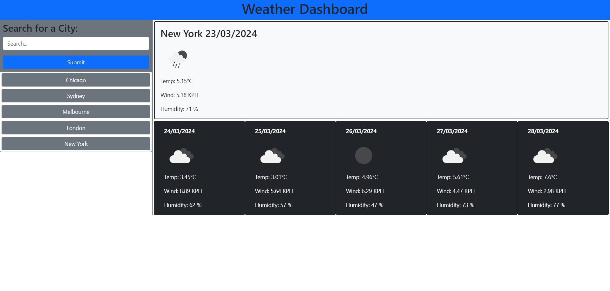

# weather-dashboard

## Description

The Weather Dashboard is a quick and easy way for a user to view the current weather and a 5 day forecast of any city around the world.

## Usage

The user must enter a city name in the search input field and click `Submit` or hit `Enter` on their keyboard. The results for the given city are then printed on the page. At the same time, a button labled with the searched city's name is printed below the search form. This `search history` will persist in localStorage so, if a user wishes to revisit a previously searched city, they need only click the relevent button.

>Deployment can be found here:
[https://simonjbr.github.io/weather-dashboard/](https://simonjbr.github.io/weather-dashboard/)

>Screenshot of deployed webpage:

## Credits

simonjbr

Libraries used:
- Bootstrap
- Dayjs
- jQuery

OpenWeatherMAP API 5 Day Forecast

## License

Please refer to license information in the repository